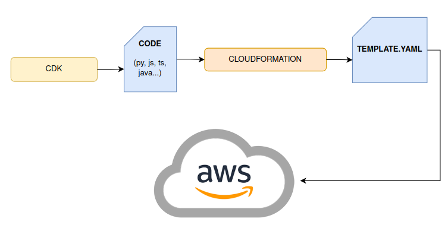

<table align="center">
  <tr>
    <td>
      
    </td>
    <td>
      
    </td>
    <td>
      
    </td>
  </tr>
</table>

---

# OVERVIEW

## What is a CDK ?

**AWS Cloud Development Kit** (AWS CDK) is an open-source framework for defining cloud infrastructure.

### Key Features

- **Imperative to Declarative**: Transforms imperative code into declarative CloudFormation templates.
- **CloudFormation Integration**: Utilizes CloudFormation for infrastructure creation.
- **Language Support**: Core in TypeScript, with `JSII` enabling compatibility with:
  - `TypeScript`
  - `Python`
  - `Java`
  - `C#`
  - `Go`

---

## What is Cloudformation?

[CloudFormation](https://aws.amazon.com/cloudformation/) is an __Infrastructure as Code (IaC)__ tool, specialized for AWS, automating cloud resource deployment and management. It's similar to Terraform but more AWS-centric.

Key Features:
- __Stacks__: Collections of AWS resources managed as a single unit.
- __Templates__: Defined in YAML/JSON, using declarative code to specify resource configurations.

  

---

<table align="center">
  <tr>
    <td>
      
    </td>
    <td>
      
    </td>
    <td>
      
    </td>
  </tr>
</table>