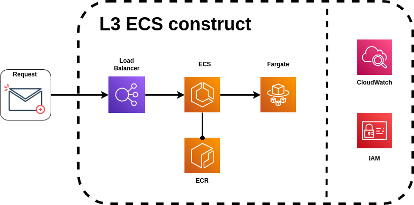

<table align="center">
  <tr>
    <td>
        
    </td>
    <td>
      
    </td>
    <td>
      
    </td>
  </tr>
</table>

---

# CORE CONCEPTS

- [CDK LIBRARY](#cdk-library)
- [CONSTRUCTS](#constructs)
- [STACK](#stack)
- [APP](#app)

---

## CDK LIBRARY

The AWS CDK Library, also referred to as `aws-cdk-lib`, is the main library that you will use to develop applications with the AWS CDK. It is developed and maintained by AWS.

This library contains base classes, such as [App](#app) and [Stack](#stack). It also contains the libraries you will use to define your infrastructure through [constructs](#constructs).

---

## CONSTRUCTS

Represents a cloud component (Lambda, EC2, DynamoDB, etc...) and encapsulates everything that AWS CloudFormation needs to create the component.

Constructs can be simple just using the AWS service or they can be more abstract and higher-level to pre-configure components for common usage.

### L1 CFN resources:

L1 constructs, also known as _CFN resources_, are the lowest-level construct and offer no abstraction. Each L1 construct maps directly to a single AWS CloudFormation resource.

In the AWS Construct Library, L1 constructs are named starting with `Cfn`.

  

### L2 Curated Constructs:

L2 constructs, also known as _curated constructs_, are thoughtfully developed by the CDK team and are usually the most widely used construct type. Compared to L1 constructs, L2 constructs provide a higher-level abstraction through an intuitive intent-based API.

The `s3.Bucket` class is an example of an L2 construct for an Amazon Simple Storage Service (Amazon S3) bucket resource.

Here is an example where a lambda function and s3 bucket are created and constrained to work together.

  

### L3 Patterns:

L3 constructs, also known as _patterns_, are the highest-level of abstraction. Each L3 construct can contain a collection of resources that are configured to work together to accomplish a specific task or service within your application.

They are built around a particular approach toward solving a problem and providing a solution.

The `ecsPatterns.ApplicationLoadBalancedFargateService` class is an example of an L3 construct that represents an AWS Fargate service running on an Amazon Elastic Container Service (Amazon ECS) cluster and fronted by an application load balancer.

  

---

## STACK

An AWS Cloud Development Kit (AWS CDK) stack is a collection of one or more constructs, which define AWS resources.

Each CDK stack represents an AWS CloudFormation stack in your CDK app. At deployment, constructs within a stack are provisioned as a single unit, called an AWS CloudFormation stack.

A AWS Cloudformation stack is a collection of AWS resources that you can manage as a single unit. In other words, you can create, update, or delete a collection of resources by creating, updating, or deleting stacks.

A stack, for instance, can include all the resources required to run a web application, such as a web server, a database, and networking rules. If you no longer require that web application, you can simply delete the stack, and all of its related resources are deleted.

Since CDK stacks are implemented through AWS CloudFormation stacks, [AWS CloudFormation quotas](https://docs.aws.amazon.com/AWSCloudFormation/latest/UserGuide/cloudformation-limits.html) and limitations apply (limit of resources by stack). 

By organizing resources into different stacks, you can separate concerns or different aspects of your infrastructure. For instance, you might have separate stacks for networking (VPC, subnets), compute resources (ECS, Lambda), and data storage (DynamoDB, S3).

---

## APP

The AWS Cloud Development Kit (AWS CDK) application or app is a collection of one or more CDK [stacks](#stack).

Represents the entire cloud application and is the highest level in the AWS CDK hierarchy (the root of the construct).
- Orchestrates the lifecycle of the stacks and resources within it
- Can have one or multiple stacks in it and allows the sharing of resources.
- App lifecycle is:
    - Construct, Prepare, Validate, Synthesize, Deploy

  

---

<table align="center">
  <tr>
    <td>
        
    </td>
    <td>
      
    </td>
    <td>
      
    </td>
  </tr>
</table>