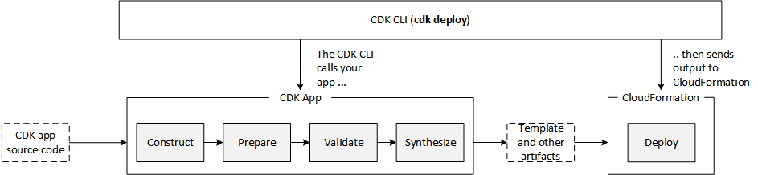

<table align="center">
  <tr>
    <td>
      
    </td>
    <td>
      
    </td>
    <td>
      
    </td>
  </tr>
</table>

---

# DEPLOYING CYCLE

- [Deploying commands](#deploying-commands)
- [Theoretical steps](#theoretical-steps)

---

## Deploying commands

<table border="1" cellpadding="10">
  <tr>
    <th>Purpose</th>
    <th>Command</th>
    <th>Explanation</th>
  </tr>
  
  <!-- Initial Project Setup -->
  <tr>
    <td rowspan="2">Initial Project Setup</td>
    <td><code>pip install -r requirements.txt</code></td>
    <td>Installs the Python dependencies listed in <code>requirements.txt</code> using pip.</td>
  </tr>
  <tr>
    <td><code>cdk bootstrap aws://<account-id>/<region></code></td>
    <td>Bootstraps the environment with the necessary resources like an S3 bucket for deployment assets.</td>
  </tr>

  <!-- Deployment Commands -->
  <tr>
    <td rowspan="3">Deployment</td>
    <td><code>cdk synth</code></td>
    <td>Generates the CloudFormation template based on your CDK app, allowing you to review it before deployment.</td>
  </tr>
  <tr>
    <td><code>cdk deploy</code></td>
    <td>Deploys the stack(s) defined in your CDK app to your AWS account.</td>
  </tr>
  <tr>
    <td><code>cdk diff</code></td>
    <td>Displays the differences between the deployed stack and the changes in your CDK app.</td>
  </tr>

  <!-- Future Management -->
  <tr>
    <td rowspan="3">Future Management</td>
    <td><code>cdk deploy</code></td>
    <td>Deploys any updates or changes to your stack(s) after making modifications to your CDK app.</td>
  </tr>
  <tr>
    <td><code>cdk destroy</code></td>
    <td>Destroys the deployed stack(s) and deletes all associated resources.</td>
  </tr>
  <tr>
    <td><code>conda update --all</code></td>
    <td>Updates all packages within your Conda environment to the latest versions.</td>
  </tr>
</table>

---

## Theoretical steps

The following are the steps that CDK performs to interpret and generate the necessary infrastructure in AWS.

What it does is the following:
1. It interprets all the code that is at the `App` level.
It performs the synthesis action (`cdk synth`) to generate artifacts for `Cloudformation`.
    - This assumes that it checks all the constructs and generates the `Cloudformation` templates.
Generate unique ids (arn) for each of the assets.
    - The assets are understood as the project files (scripts, dockerfiles, etc..).
4. At this point the CDK starts bootstrapping (`cdk bootstrap`) to create the environment where all the assets will be stored.
    - Creates an stack (often called `CDKToolkit`) with all the necessary resources to make the deployment.
    - For example, in this bucket you will store the docker image while you are converting it before loading it to ECR.
5. The App is deployed.
    - The App is in charge of generating the App Tree from which all its constructs will hang.
    - Each construct will perform the following series to generate the CF code:
        - prepare > validate > synthesize
    - Start the deployment in AWS

  

---

<table align="center">
  <tr>
    <td>
      
    </td>
    <td>
      
    </td>
    <td>
      
    </td>
  </tr>
</table>
